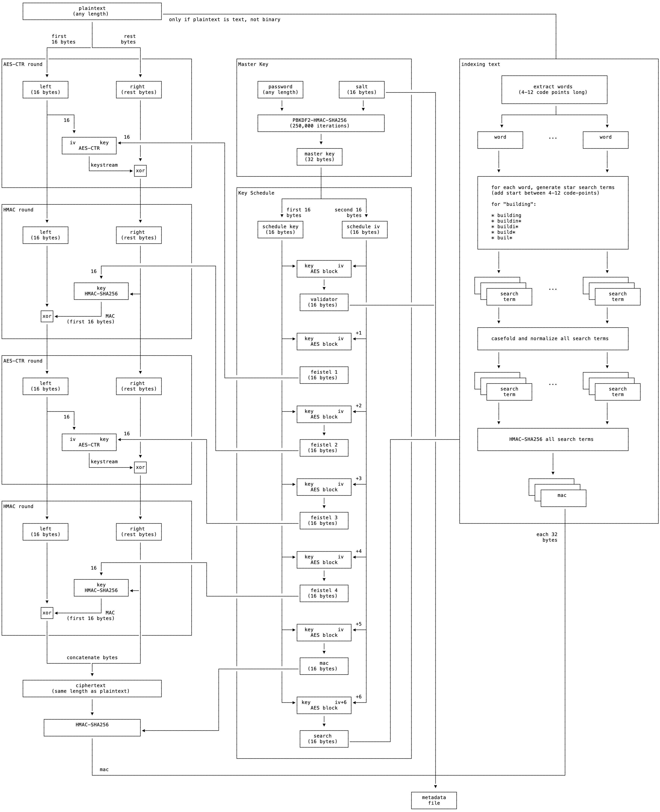

# Encrypted File Search

The `fencrypt` program implements encrypted search for text and binary files greater than 32 bytes. Supports all unicode characters.

This program also encrypts and decrypts files using a four-round feistel cipher, and supports encrypted search and ciphertext tamper detection with HMAC-SHA-256.

## Usage

Encrypt:

`fencrypt -e <file_name>`

Decrypt:

`fencrypt -d <file_name>`

Search:

`fencrypt -s "string"`

Search supports word prefix:

`fencrypt -s string*`


```
❯ ./fencrypt -h
usage: fencrypt [-h] [-d] [-e] [-s] [-v] inputs [inputs ...]

Encrypts and decrypts binary and text files. Plaintext search on encrypted files.

positional arguments:
  inputs      file path or search string

optional arguments:
  -h, --help  show this help message and exit
  -d          decrypt
  -e          encrypt
  -s          search
  -v          verbose output to terminal
```

### Example

```
❯ make clean all

# https://www.gutenberg.org/ebooks/2264
curl -s https://www.gutenberg.org/cache/epub/2264/pg2264.txt | tee macbeth.txt.plain > macbeth.txt
encrypting with password: 'macbeth.txt'
echo -n macbeth.txt | ./fencrypt -e -v macbeth.txt
{
    "macbeth.txt": "4241a8f0f9711be7ef8df0f78280c827dd95bbe1c15983f98194e5bc365707e2"
}

# https://www.gutenberg.org/ebooks/17996
curl -s https://www.gutenberg.org/files/17996/17996-0.txt | tee aeschylus.txt.plain > aeschylus.txt
encrypting with password: 'aeschylus.txt'
echo -n aeschylus.txt | ./fencrypt -e -v aeschylus.txt
{
    "aeschylus.txt": "a8aded8f6c715ae675f9cfc5fea5bd2a902284fa2f4732c2b001e425bf7082c8"
}

# https://en.wikipedia.org/wiki/Block_cipher_mode_of_operation
curl -s https://upload.wikimedia.org/wikipedia/commons/f/f0/Tux_ecb.jpg | tee ecb.jpg.plain > ecb.jpg
encrypting with password: 'ecb.jpg'
echo -n ecb.jpg | ./fencrypt -e -v ecb.jpg
{
    "ecb.jpg": "4140d3287a64918b56c80de058936c047b2f86c72021d4be95e7471a97fbc7d1"
}

echo -n wrongpassword | ./fencrypt -s crickets

echo -n macbeth.txt | ./fencrypt -s haha

echo -n macbeth.txt | ./fencrypt -s -v crickets
Incorrect password for file .fenc-meta.aeschylus.txt.
Incorrect password for file .fenc-meta.ecb.jpg.
{
    "macbeth.txt": "4241a8f0f9711be7ef8df0f78280c827dd95bbe1c15983f98194e5bc365707e2"
}
macbeth.txt

echo -n macbeth.txt | ./fencrypt -s cric*
macbeth.txt

echo -n aeschylus.txt | ./fencrypt -s άδραστου
aeschylus.txt

echo -n aeschylus.txt | ./fencrypt -s άδρασ*
aeschylus.txt
```
## Under the Hood

When encrypting, a 32-byte "master" key is generated from a user-supplied password for each file encrypted, using PBKDF2 with HMAC-SHA-256 as the PRF.

The 16-byte salt is randomly generated from a secure random number generator, and stored in the per-file metadata.

A series of 16-byte keys are generated using counter mode:

- AES(Master_key, IV) : a password validator (see below).
- AES(Master_key, IV + 1) : the first round key in the Feistel Cipher
- AES(Master_key, IV + 2) : the second round key in the Feistel Cipher
- AES(Master_key, IV + 3) : the third round key in the Feistel Cipher
- AES(Master_key, IV + 4) : the fourth round key in the Feistel Cipher
- AES(Master_key, IV + 5) : the MAC key.
- AES(Master_key, IV + 6) : the key used for encrypting search terms.

UTF-8 encoded text files are indexed for search terms upon encryption. Search terms are any contiguous sequence of Unicode letters (character classes Lu, Ll, Lt, Lm, Lo), non-spacing marks (class Mn), decimel digits (Nd) and connector punctuation (Pc) between 4-12 codepoints. Search terms are casefolded, normalized, then MAC'd using HMAC-SHA-256.

The salt, validator, mac, and hashed search terms are stored in a per-file generated metadata. The password and hash are validated upon decryption.

### Architecture Diagram

<details>
<summary>ascii art 😀</summary>

```
       ┌─────────────────────────────────────────────┐
       │                  plaintext                  │
       │                (any length)                 │──────────────────────────────────────────────────────────────────────────────────────────────────────────────────────────────────┐
       └─────────────────────────────────────────────┘  only if plaintext is text, not binary                                                                                           │
                              │                                                                                                                                                         │
                              │                                                                                                                                                         │
                 first        │          rest                                                                                                                                           │
                 16 bytes     │         bytes                                                                                                                                           │
               ┌──────────────└───────────────┐                                                                                                                                         │
               │                              │                                                                                                                                         │
┌──────────────│──────────────────────────────│────────────────┐              ┌─────────────────────────────────────────────────────────┐               ┌───────────────────────────────┴─────────────────────────────────┐
│AES-CTR round │                              │                │              │Master Key                                               │               │indexing text                                                    │
│              │                              │                │              │                                                         │               │                                                                 │
│              ▼                              ▼                │              │                                                         │               │             ┌──────────────────────────────────┐                │
│      ┌──────────────┐               ┌──────────────┐         │              │      ┌──────────────┐           ┌──────────────┐        │               │             │                                  │                │
│      │     left     │               │    right     │         │              │      │   password   │           │     salt     │        │               │             │          extract words           │                │
│      │  (16 bytes)  │               │ (rest bytes) │         │              │      │ (any length) │           │  (16 bytes)  │────────────────┐       │             │     (4-12 code points long)      │                │
│      └──────────────┘               └──────────────┘         │              │      └──────────────┘           └──────────────┘        │       │       │             │                                  │                │
│              │                              │                │              │              │                          │               │       │       │             └──────────────────────────────────┘                │
│              │                              │                │              │              ▼                          ▼               │       │       │                               │                                 │
│              ├────────┐                     │                │              │      ┌─────────────────────────────────────────┐        │       │       │             ┌─────────────────┴────────────────┐                │
│              │     16 │                     │                │              │      │           PBKDF2-HMAC-SHA256            │        │       │       │             │                                  │                │
│              │        │                     │                │              │      │          (250,000 iterations)           │        │       │       │             ▼                                  ▼                │
│              │        ▼                     │                │              │      └─────────────────────────────────────────┘        │       │       │     ┌──────────────┐                   ┌──────────────┐         │
│              │    ┌─────────────────┐  16   │                │              │                           │                             │       │       │     │     word     │        ...        │     word     │         │
│              │    │  iv        key  │◀──────────────────────────────────┐   │                           ▼                             │       │       │     │              │                   │              │         │
│              │    │     AES-CTR     │       │                │          │   │                   ┌──────────────┐                      │       │       │     └──────────────┘                   └──────────────┘         │
│              │    └─────────────────┘       │                │          │   │                   │  master key  │                      │       │       │            │                                   │                │
│              │             │                ▼                │          │   │                   │  (32 bytes)  │                      │       │       │            │                                   │                │
│              │             │keystream     ┌───┐              │          │   │                   └──────────────┘                      │       │       │            │                                   │                │
│              │             └─────────────▶│xor│              │          │   │                           │                             │       │       │            ▼                                   ▼                │
│              │                            └───┘              │          │   └───────────────────────────┼─────────────────────────────┘       │       │     ┌─────────────────────────────────────────────────┐         │
│              │                              │                │          │                               │                                     │       │     │                                                 │         │
└──────────────┼──────────────────────────────┼────────────────┘          │   ┌───────────────────────────┼─────────────────────────────┐       │       │     │    for each word, generate star search terms    │         │
               │                              │                           │   │Key Schedule               │                             │       │       │     │    (add start between 4-12 code-points)         │         │
               │                              │                           │   │              ┌────────────┴──────────────┐              │       │       │     │                                                 │         │
┌──────────────┼──────────────────────────────┼────────────────┐          │   │              │                           │              │       │       │     │    for "building":                              │         │
│HMAC round    │                              │                │          │   │              │ first 16        second 16 │              │       │       │     │                                                 │         │
│              │                              │                │          │   │              ▼ bytes               bytes ▼              │       │       │     │    * building                                   │         │
│              ▼                              ▼                │          │   │      ┌──────────────┐            ┌──────────────┐       │       │       │     │    * buildin*                                   │         │
│      ┌──────────────┐               ┌──────────────┐         │          │   │      │ schedule key │            │ schedule iv  │       │       │       │     │    * buildi*                                    │         │
│      │     left     │               │    right     │         │          │   │      │  (16 bytes)  │            │  (16 bytes)  │       │       │       │     │    * build*                                     │         │
│      │  (16 bytes)  │               │ (rest bytes) │         │          │   │      └──────────────┘            └──────────────┘       │       │       │     │    * buil*                                      │         │
│      └──────────────┘               └──────────────┘         │          │   │              │                           │              │       │       │     │                                                 │         │
│              │                              │                │          │   │              │                           │              │       │       │     └─────────────────────────────────────────────────┘         │
│              │                              │                │          │   │              │                           │              │       │       │            │                                   │                │
│              │                              │                │          │   │              │    ┌─────────────────┐    │              │       │       │            │                                   │                │
│              │                 ┌─────────────────────────────────────┐  │   │              ├───▶│  key        iv  │◀───┤              │       │       │            │                                   │                │
│              │              16 │            │                │       │  │   │              │    │    AES block    │    │              │       │       │            ▼                                   ▼                │
│              │                 ▼            │                │       │  │   │              │    └─────────────────┘    │              │       │       │    ┌──────────────┐                    ┌──────────────┐         │
│              │        ┌─────────────────┐   │                │       │  │   │              │             │             │              │       │       │    │ ┌────────────┴─┐                  │ ┌────────────┴─┐       │
│              │        │       key       │   │                │       │  │   │              │             ▼             │              │       │       │    │ │ ┌────────────┴─┐     ...        │ │ ┌────────────┴─┐     │
│              │        │   HMAC-SHA256   │◀──┤                │       │  │   │              │     ┌───────────────┐     │              │       │       │    └─┤ │    search    │                └─┤ │    search    │     │
│              │        └─────────────────┘   │                │       │  │   │              │     │   validator   │     │              │       │       │      └─┤     term     │                  └─┤     term     │     │
│              ▼                 │            │                │       │  │   │              │     │  (16 bytes)   │────────────────────────────│       │        └──────────────┘                    └──────────────┘     │
│            ┌───┐               │            │                │       │  │   │              │     └───────────────┘     │              │       │       │            │                                   │                │
│            │xor│◀──────────────┘ MAC        │                │       │  │   │              │                           │              │       │       │            │                                   │                │
│            └───┘    (first 16 bytes)        │                │       │  │   │              │                           │              │       │       │            ▼                                   ▼                │
│              │                              │                │       │  │   │              │                           │              │       │       │     ┌─────────────────────────────────────────────────┐         │
│              │                              │                │       │  │   │              │    ┌─────────────────┐ +1 │              │       │       │     │                                                 │         │
└──────────────┼──────────────────────────────┼────────────────┘       │  │   │              ├───▶│  key        iv  │◀───┤              │       │       │     │    casefold and normalize all search terms      │         │
               │                              │                        │  │   │              │    │    AES block    │    │              │       │       │     │                                                 │         │
               │                              │                        │  │   │              │    └─────────────────┘    │              │       │       │     └─────────────────────────────────────────────────┘         │
┌──────────────┼──────────────────────────────┼────────────────┐       │  │   │              │                           │              │       │       │            │                                   │                │
│AES-CTR round │                              │                │       │  │   │              │                           │              │       │       │            │                                   │                │
│              │                              │                │       │  │   │              │     ┌───────────────┐     │              │       │       │            ▼                                   ▼                │
│              ▼                              ▼                │       │  │   │              │     │   feistel 1   │     │              │       │       │    ┌──────────────┐                    ┌──────────────┐         │
│      ┌──────────────┐               ┌──────────────┐         │       │  └────────────────────────│  (16 bytes)   │     │              │       │       │    │ ┌────────────┴─┐                  │ ┌────────────┴─┐       │
│      │     left     │               │    right     │         │       │      │              │     └───────────────┘     │              │       │       │    │ │ ┌────────────┴─┐     ...        │ │ ┌────────────┴─┐     │
│      │  (16 bytes)  │               │ (rest bytes) │         │       │      │              │                           │              │       │       │    └─┤ │    search    │                └─┤ │    search    │     │
│      └──────────────┘               └──────────────┘         │       │      │              │                           │              │       │       │      └─┤     term     │                  └─┤     term     │     │
│              │                              │                │       │      │              │                           │              │       │       │        └──────────────┘                    └──────────────┘     │
│              │                              │                │       │      │              │    ┌─────────────────┐ +2 │              │       │       │            │                                   │                │
│              ├────────┐                     │                │       │      │              ├───▶│  key        iv  │◀───┤              │       │       │            │                                   │                │
│              │     16 │                     │                │       │      │              │    │    AES block    │    │              │       │       │            │                                   │                │
│              │        │                     │                │       │      │              │    └─────────────────┘    │              │       │       │            ▼                                   ▼                │
│              │        ▼                     │                │       │      │              │             │             │              │       │       │     ┌─────────────────────────────────────────────────┐         │
│              │    ┌─────────────────┐  16   │                │       │      │              │             ▼             │              │       │       │     │                                                 │         │
│              │    │  iv        key  │◀────────────────────────────┐  │      │              │     ┌───────────────┐     │       ┌──────────────────────┤     │          HMAC-SHA256 all search terms           │         │
│              │    │     AES-CTR     │       │                │    │  │      │              │     │   feistel 2   │     │       │      │       │       │     │                                                 │         │
│              │    └─────────────────┘       │                │    │  └───────────────────────────│  (16 bytes)   │     │       │      │       │       │     └─────────────────────────────────────────────────┘         │
│              │             │                ▼                │    │         │              │     └───────────────┘     │       │      │       │       │                              │                                  │
│              │             │keystream     ┌───┐              │    │         │              │                           │       │      │       │       │                              │                                  │
│              │             └─────────────▶│xor│              │    │         │              │                           │       │      │       │       │                              │                                  │
│              │                            └───┘              │    │         │              │                           │       │      │       │       │                              ▼                                  │
│              │                              │                │    │         │              │    ┌─────────────────┐ +3 │       │      │       │       │                      ┌──────────────┐                           │
└──────────────┼──────────────────────────────┼────────────────┘    │         │              ├───▶│  key        iv  │◀───┤       │      │       │       │                      │ ┌────────────┴─┐                         │
               │                              │                     │         │              │    │    AES block    │    │       │      │       │       │                      │ │ ┌────────────┴─┐                       │
               │                              │                     │         │              │    └─────────────────┘    │       │      │       │       │                      └─┤ │     mac      │                       │
┌──────────────┼──────────────────────────────┼────────────────┐    │         │              │             │             │       │      │       │       │                        └─┤              │                       │
│HMAC round    │                              │                │    │         │              │             ▼             │       │      │       │       │                          └──────────────┘                       │
│              │                              │                │    │         │              │     ┌───────────────┐     │       │      │       │       │                                  │                              │
│              ▼                              ▼                │    │         │              │     │   feistel 3   │     │       │      │       │       │                                  │                              │
│      ┌──────────────┐               ┌──────────────┐         │    └──────────────────────────────│  (16 bytes)   │     │       │      │       │       └──────────────────────────────────┼──────────────────────────────┘
│      │     left     │               │    right     │         │              │              │     └───────────────┘     │       │      │       │                                          │
│      │  (16 bytes)  │               │ (rest bytes) │         │              │              │                           │       │      │       │                                 each 32  │
│      └──────────────┘               └──────────────┘         │              │              │                           │       │      │       │                                   bytes  │
│              │                              │                │              │              │                           │       │      │       │                                          │
│              │                              │                │              │              │    ┌─────────────────┐ +4 │       │      │       │                                          │
│              │                              │                │              │              ├───▶│  key        iv  │◀───┤       │      │       │                                          │
│              │                 ┌──────────────────────────────────┐         │              │    │    AES block    │    │       │      │       │                                          │
│              │              16 │            │                │    │         │              │    └─────────────────┘    │       │      │       │                                          │
│              │                 ▼            │                │    │         │              │             │             │       │      │       │                                          │
│              │        ┌─────────────────┐   │                │    │         │              │             ▼             │       │      │       │                                          │
│              │        │       key       │   │                │    │         │              │     ┌───────────────┐     │       │      │       │                                          │
│              │        │   HMAC-SHA256   │◀──│                │    │         │              │     │   feistel 4   │     │       │      │       │                                          │
│              │        └─────────────────┘   │                │    └──────────────────────────────│  (16 bytes)   │     │       │      │       │                                          │
│              ▼                 │            │                │              │              │     └───────────────┘     │       │      │       │                                          │
│            ┌───┐               │            │                │              │              │                           │       │      │       │                                          │
│            │xor│◀──────────────┘ MAC        │                │              │              │                           │       │      │       │                                          │
│            └───┘    (first 16 bytes)        │                │              │              │                           │       │      │       │                                          │
│              │                              │                │              │              │    ┌─────────────────┐ +5 │       │      │       │                                          │
│              │                              │                │              │              ├───▶│  key        iv  │◀───┤       │      │       │                                          │
└──────────────│──────────────────────────────│────────────────┘              │              │    │    AES block    │    │       │      │       │                                          │
               │                              │                               │              │    └─────────────────┘    │       │      │       │                                          │
               │                              │                               │              │             │             │       │      │       │                                          │
               │                              │                               │              │             ▼             │       │      │       │                                          │
               │      concatenate bytes       │                               │              │     ┌───────────────┐     │       │      │       │                                          │
               └──────────────┌───────────────┘                               │              │     │      mac      │     │       │      │       │                                          │
                              │                                         ┌──────────────────────────│  (16 bytes)   │     │       │      │       │                                          │
                              ▼                                         │     │              │     └───────────────┘     │       │      │       │                                          │
       ┌─────────────────────────────────────────────┐                  │     │              │                           │       │      │       │                                          │
       │                 ciphertext                  │                  │     │              │                           │       │      │       │                                          │
       │         (same length as plaintext)          │                  │     │              │                           │       │      │       │                                          │
       └─────────────────────────────────────────────┘                  │     │              │    ┌─────────────────┐ +6 │       │      │       │                                          │
                              │                                         │     │              └───▶│ key        iv+6 │◀───┘       │      │       │                                          │
                              │                                         │     │                   │    AES block    │            │      │       │                                          │
                              ▼                                         │     │                   └─────────────────┘            │      │       │                                          │
              ┌───────────────────────────────┐                         │     │                            │                     │      │       │                                          │
              │          HMAC-SHA256          │                         │     │                            ▼                     │      │       │                                          │
              │                               │◀────────────────────────┘     │                    ┌───────────────┐             │      │       │                                          │
              └───────────────────────────────┘                               │                    │    search     │             │      │       │                                          │
                              │                                               │                    │  (16 bytes)   │─────────────┘      │       │                                          │
                              │                                               │                    └───────────────┘                    │       │                                          │
                              │                                               │                                                         │       │                                          │
                              │                                               └─────────────────────────────────────────────────────────┘       │                                          │
                              │                                                                                                                 │                                          │
                              │  mac                                                                                                            │                                          │
                              └─────────────────────────────────────────────────────────────────────────────────────────────────────────────────┼──────────────────────────────────────────┘
                                                                                                                                                │
                                                                                                                                                ▼
                                                                                                                                        ┌──────────────┐
                                                                                                                                        │   metadata   │
                                                                                                                                        │     file     │
                                                                                                                                        └──────────────┘
```

</details>

<details>
<summary>png</summary>



</details>